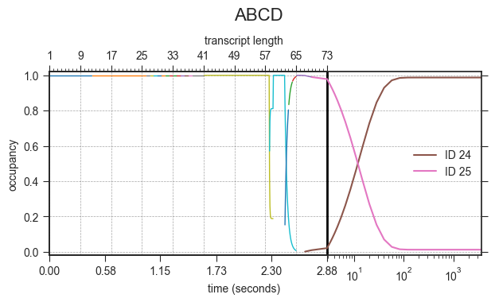

# DrTransformer -- heuristic cotranscriptional folding.

DrTransformer (short for "DNA-to-RNA transformer") is a program for heuristic
and deterministic cotranscriptional folding simulations of RNA molecules. The
software uses the [ViennaRNA] package which is available through the [ViennaRNA
license].

## Installation
```sh
  ~$ python setup.py install
  ~$ python -m pytest tests/ -v -s
```

### ViennaRNA dependencies
This package uses the [ViennaRNA] library. Generally, every official release of
DrTransformer should be compatible with the latest [ViennaRNA bioconda] version.
For features available only on the development branches, you may have to install
a more recent version from the [ViennaRNA source] on Github.

## Usage
Until further documentation is available, please use the *--help* options of the 
command line executables:
```sh
  ~$ DrTransformer --help
  ~$ DrPlotter --help
```

### An example cotranscriptional folding simulation
As an example, let's do a quick investigation of a cotranscriptional folding
trap designed by [Xayaphoummine et al. (2006)]. The relevant files can be found
in the subfolder [`examples/`], in particular the three files [`ABCD.fa`],
[`DCBA.fa`] and [`DCBAmod.fa`]. Those files contain only a fasta header and the
respective sequence from the publication.
```sh
  ~$ cat ABCD.fa | DrTransformer --name ABCD --logfile 
```
The above command line call of DrTransformer produced two files:
 - `ABCD.log` contains a human-readable summary of the cotranscriptional folding process. 
 - `ABCD.drf` contains the details of the cotranscriptional folding simulation. 

#### Structure-based data analysis
DrPlotter supports different types of visual analysis for the `.drf` file
format. The following command line call reads the previously generated file
`ABCD.drf` and produces a plot called `ABCD.png`.
```sh
  ~$ cat ABCD.drf | DrPlotter --name ABCD --format png
```


The legend of `ABCD.png` must be interpreted in combination with the `ABCD.log`
file. **Note that the structure IDs from your newly generated files might not
match the ones shown here.** For example, to see which structures are shown at
the simulation of nucleotide 73, read the log file entries for this transcript
length:
```
73    1 ....(((((((((((((((....)))))))))))))))....(((((((((.......)))))))))...... -42.40 [0.0240 -> 0.9924] ID = 23
73    2 ....(((((((((((((((....)))))))))))))))....(((((((((....)).)))))))........ -39.40 [0.7734 -> 0.0076] ID = 21
73    3 ....(((((((((((((((....)))))))))))))))....(((((((......)).))))).......... -34.80 [0.2027 -> 0.0000] ID = 19

```
The logfile lists three potentially interesting structures (in order of their
free energy), it shows their occupancy at the start of the simulation and
at the end of a simulation in square brackets, and it provides the ID to follow
a specific structure through the transcription process. This ID is also used as 
a label in the plot `ABCD.png`.

### Motif-based data analysis
Instead of following specific structures, one can investigate at which point
the different molecules form specific helix motifs. The paper lists four
potential helices (*Pa, Pb, Pc, Pd*) for comparison, we provide them in
dot-bracket notation in the files [`ABCD.motifs`], [`DCBA.motifs`] and
[`DCBAmod.motifs`], respectively.
```sh
  ~$ cat ABCD.drf | DrPlotter --name ABCD-motifs --molecule ABCD --format png --motiffile ABCD.motifs --motifs Pa Pb Pc Pd
  ~$ cat DCBA.drf | DrPlotter --name DCBA-motifs --molecule DCBA --format png --motiffile DCBA.motifs --motifs Pa Pb Pc Pd
  ~$ cat DCBAmod.drf | DrPlotter --name DCBAmod-motifs --molecule DCBAmod --format png --motiffile DCBAmod.motifs --motifs Pa Pb Pc Pd
```
<br>
ABCD forms only structures with motif Pa, Pb but not Pc and Pd. Note how motif
Pb is not formed "immediately", because there are competing helix motifs which
are cotranscriptionally favored. (Those motifs can be seen in the previous
analysis: the structures with ID 19 and 21.)


<br>
DCBA forms structures with all motifs. The structures containing motifs Pc and
Pd dominate with more than 90%, the structures containing motifs Pa and Pb are
below 10% of the population. Eventually, the structures with Pa and Pb will be
dominant, but not on the time scale simulated here. (Can you repeat the analysis
to see how much time it needs until Pa and Pb dominate the ensemble?)

<br>
As shown in the publication, a single point mutation in DCBA, here DCBAmod is
sufficient to drastically shift the balance between Pa/Pb and Pc/Pd containing 
structures.

### Tips and tricks
 - The header of the logfile contains all relevant DrTransformer parameters that generated the file. 
 - You can use the parameter `--plot-minh` to group similar structures (separated by energy barriers < plot-minh) together. 
    In contrast to the `--t-fast` parameter, this will not affect the accuracy of the model.
 - Use `--pause-sites` to see the effects of pausing at specific nucleotides on cotranscriptional folding.
 - Motifs for DrPlotter can also contain 'x' in the dot-bracket notation for *must be unpaired*.

## Version
v0.10 -- moved to beta status (first official release)
  * changes in parameter defaults 
  * bugfix in linalg
  * new DrPlotter simulation layout and motif plotting
  * repaired code to enable plotting including pause sites

v0.9 -- standalone package (no official release)
  * extraction from the [ribolands] package to a standalone Python package.
  * using scipy and numpy for matrix exponentials (instead of [treekin])
  * implemented lookahead to skip pruning of potentially relevant future structures

## License
Same as the [ViennaRNA license]. 

## Cite
Badelt et al. (in preparation)
 
[//]: References
[ViennaRNA]: <http://www.tbi.univie.ac.at/RNA>
[ViennaRNA source]: <https://github.com/ViennaRNA/ViennaRNA>
[ViennaRNA bioconda]: <https://anaconda.org/bioconda/viennarna>
[ViennaRNA license]: <https://github.com/ViennaRNA/ViennaRNA/blob/master/license.txt>
[ribolands]: <https://github.com/bad-ants-fleet/ribolands>
[treekin]: <https://github.com/ViennaRNA/Treekin>
[Xayaphoummine et al. (2006)]: <https://doi.org/10.1093/nar/gkl1036>
[`examples/`]: <https://github.com/bad-ants-fleet/drtransformer/tree/master/examples>
[`ABCD.fa`]: <https://github.com/bad-ants-fleet/drtransformer/blob/master/examples/ABCD.fa>
[`DCBA.fa`]: <https://github.com/bad-ants-fleet/drtransformer/blob/master/examples/DCBA.fa>
[`DCBAmod.fa`]: <https://github.com/bad-ants-fleet/drtransformer/blob/master/examples/DCBAmod.fa>
[`ABCD.motifs`]: <https://github.com/bad-ants-fleet/drtransformer/blob/master/examples/ABCD.motifs>
[`DCBA.motifs`]: <https://github.com/bad-ants-fleet/drtransformer/blob/master/examples/DCBA.motifs>
[`DCBAmod.motifs`]: <https://github.com/bad-ants-fleet/drtransformer/blob/master/examples/DCBAmod.motifs>
